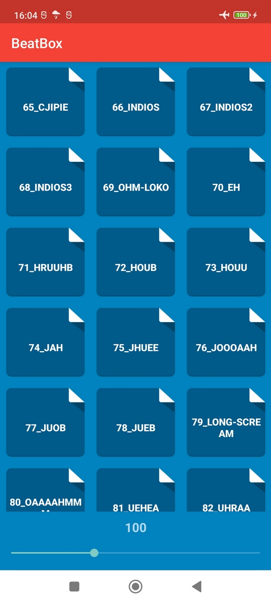
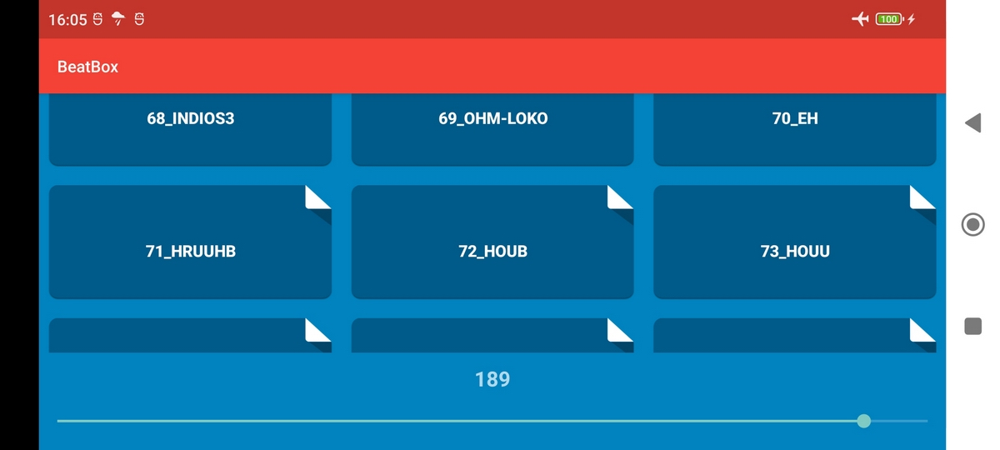


  
# BeatBox
    
    
**Описание**

Приложение состоит из одной Activity с архитектурой MVVM. Приложение предназначено для  воспроизведения с разной скоростью (от х0,5 до х2.0) звучания всевозможных угрожающих звуков из списка звуковых файлов.
    
    
**Приобретённые навыки**

• Работа с активами.  
• Управление скоростью воспроизведения звуковых файлов.  
• Изменение и настройка темы.  
• Придание кнопкам различных геометрических форм (прямоугольник, круг).  
• Использование графических объектов в качестве кнопок.  
• Установка своей иконки для приложения.  

**Фото**

Посмотреть фото

<table>
	<tr>
		<td>
			
		</td>
		<td>
			
		</td>
    <tr>
    
</table>

