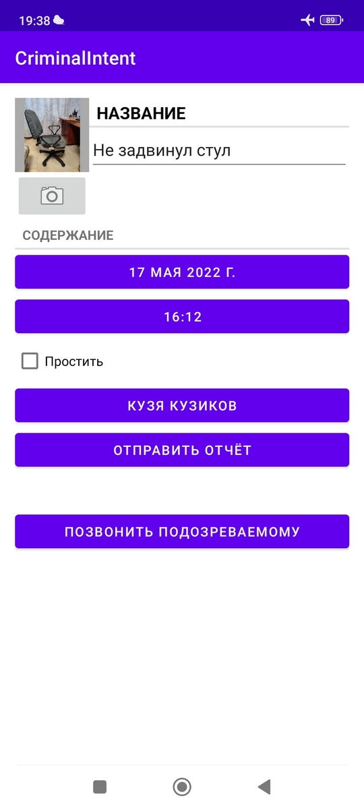
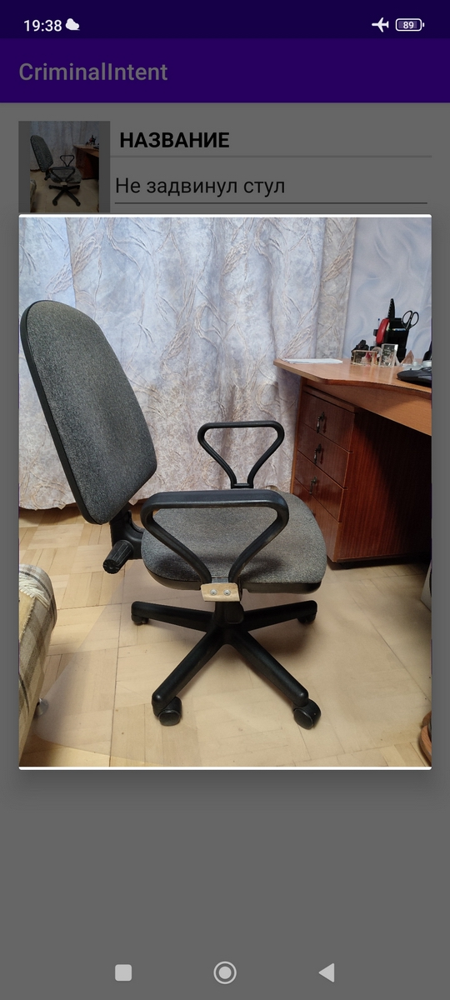

  
# CriminalIntent
    
    
**Описание**

Приложение состоит из UI-фрагментов с использованием одной Activity. Пользователь может внести информацию об офисных нарушениях коллег, указав наименование нарушения, дату и время нарушения, ФИО нарушителя (выбирается из телефонного списка контактов). Есть функционал, позволяющий сделать фото "с места преступления" и отображать данное фото в списке правонарушения. Дополнительно реализован функционал, позволяющий отправить отчёт о нарушеннии по средствам e-mail, bluetooth и др., а также позвонить нарушителю. Фотографию, которая прикреплена к нарушению можно увеличить, нажав на её миниатюру. Также имеется возможность простить нарушителя и дать ему второй шанс, нажав на соответствующую галочку. В случае, если нарушитель прощён (поставлена галочка), то в общем списке, напротив данного нарушения будет отображаться соответствующий значёк.
    
    
**Приобретённые навыки**

• Работа с фрагментами и передача информации между ними.  
• Работа с RecyclerView.  
• Реализация ViewHolder.  
• Работа с базой данных и Room Library.  
• Использование в работе LiveData.  
• Навигация по фрагментам.  
• Использование диалоговых окон для установки даты и времени.  
• Создание меню на панели приложения.  
• Работа с неявными интентами.  
• Работа с камерой.  
• Использование локализации для другого языка.  
• Реализация специальных возможностей для людей с ослабленным зрением.  

**Фото**

Посмотреть фото

  

  

<table>
	<tr>
		<td>
			
		</td>
		<td>
			
		</td>
    <td>
			
		</td>
	</tr>
</table>
